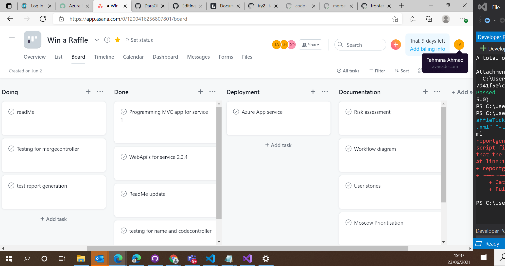
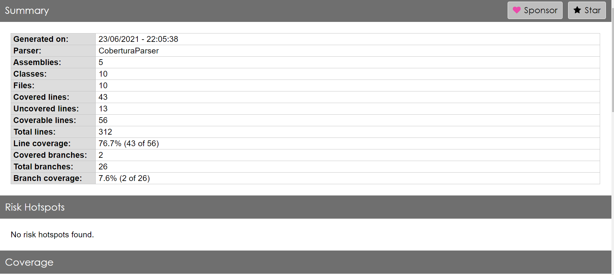
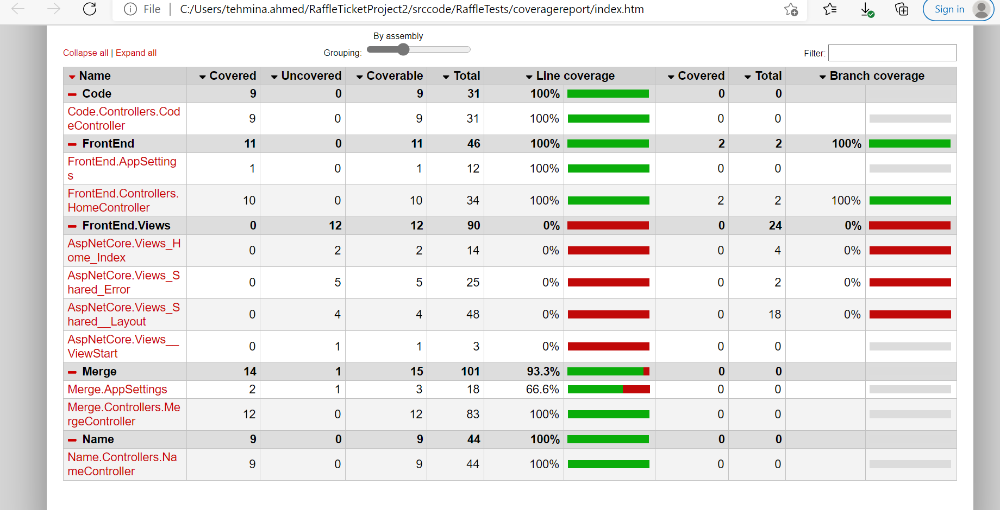

# RaffleTicketProject2

## Ticket & Prize Generator System - SFIA 2 

Project Contributor: Tehmina Ahmed 

Copyright (c) 2021 RaffleRiff

## Abstract
The RaffleTicket App was planned, designed and has been documented in this ReadMe.MD to show the process of the project. Agile Methodology was used throughout the project to ensure efficiency where possible. It's a Raffle Ticket App using a 4 services functionality. Allowing users to View Service 1, which is the FrontEnd displaying the merged service using HTML, CSS and some JavaScript. 

The FrontEnd is an MVC app consisting of 3 WebApi's created using C#. Service 1 (nameController) & 2 (codeController) are strings containing a random generator method which picks a value from the string. Service 3 is a combination/merge of service 1 & 2 where a name and code are added together randomly. The logic behind this is for a user (name) to be picked at random (like a raffle ticket) with a number (code). Service 3 uses the values from service 1 & 2 and creates conditions; so that certain users with a certain code, win certain prizes. For example, the name Kamran with the code of xxxx wins a car. 
Service 4 is what the user sees, an MVC FrontEnd containing the functions of service 3 (see below). 

### FrontEnd 

  

## Aims & Objectives 
  Aims                                                    | Objectives                                                                     |
| :----------------------------------------------------:  | :------------------------------------------------------------------------------:
| 1) Create a solution                                    | a) Curate an idea that solves an issue                                          |
| 2) Design a Full Stack App using 4 services             | b) Create a High Fidelity ProtoType/Wireframe with Lucid                        |
| 3) Setup Agile Methodology software                     | c) Create Asana board, Jira, GitHub and set time goals                          |
| 4) Implement App using CRUD Functionality               | d) Use Technologies listed below to implement App                               |
| 5) Test App using UNIT testing                          | e) Use Unit testing and test each feature of the App against requirements       |
| 6) Use CI & CD to ensure efficient version control      | f) Use GitHub and Visual Studio to continously integrate and deploy App edits   |
| 7) Deploy App                                           | g) Deploy App using GitHub actions and Terraform                                |

## Technologies & Methodologies Used
* Project Management: Agile methodology, Kanban - Asana, Jira, GitHub 
* C#
* HTML
* CSS
* ASP.NET
* Git
* Continous Integration
* Azure Portal/CLI
* Terraform 
* LucidSpark
* Jira

## Essential Features 
### Agile Methodology 

  

Here is the Asana Kanban Board used to track tasks against time and the priority order of them. The Board displays tasks that were ordered into...
To-Do,
 In Progress, and, 
 Done 
This was helpful and was used as an online diary for me to keep track of my tasks. 

## Functional & Non-Functional Requirements 
### Moscow Prioritisation

  

This technique allowed me to see which requirements would be essential to implement VS. requirements which would be a stretch goal. 

## Initial Documentation (before idea modification)

### User Stories 

  

The user stories display the scenario of how the App interacts with the user indirectly, using a frontend to display the randomly generated results and 3 webApi's running in the background. 

## Updated Documentation 

### Risk Assessment 

  

  

  

  

## Testing & Reports 
### Test 1

  

This was the first attempt at testing, the files contained errors that i was not able to easily resolve using namespace. I realised afterwards that certain configurations had to be changed because i was no longer testing using the localhost, rather i had to deploy the app to use the azure appservice URL's to test approprately. 

### Test 2

  

This was when all the tests files had been debugged from errors and passed! what a relief! Now it was time for report generation 

### Test Report

  

This is the test generated report which shows that the line coverage was 76.7%

  

The report above shows that i received 100% for all my tested controllers, which is amazing! However, for improvements' sake if i had to re-do the tests, i would find a way to exclude the views from code coverage to increase the coverage percentage overall.

## Deployment 
### Terraform 

## Report 
What I did well                                                                                                     |  How could I improve?
:-----------------------------------------------------------------------------------------------------------------: |:--------------------------------------------:
| 1) I successfully made a chnage & integrated using feature branch model                                           | a) I could have created my stretch goal databases
| 2) I used Agile methodology throughout the project to manage tasks and time                                       | b) could have used CSS/BootStrap to make App prettier
| 3) I successfully created my MVP MVC app with 4 services using C# and MySQL                                       | c) Could have integrated more JavaScript
| 4) I successfully connected to Azure App services & deployed                                                      | d) Could have done more CI using GitHub if it connected
| 5) I successfully used HTML, CSS & C# with ASP.NET to create an MVC App with webApi functionality                 | e) Could have created a CSV file and appended to database 
| 6) I was able to identify and find solutions to risks associated with development in the matrix                   | f) Could have used Angular as part of front end
| 7) I successfully tested the app and generated reports to test coverage                                           | g) Deploy via Azure Pipelines & DevOps as well 

  

## Acknowledgements 
A sincere thank you to Dara for his continuous support; and Avanade for the opportunity! 

## Developer
Tehmina Ahmed
